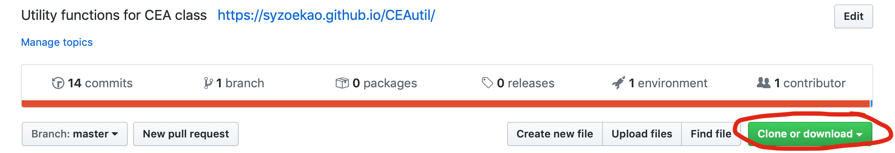
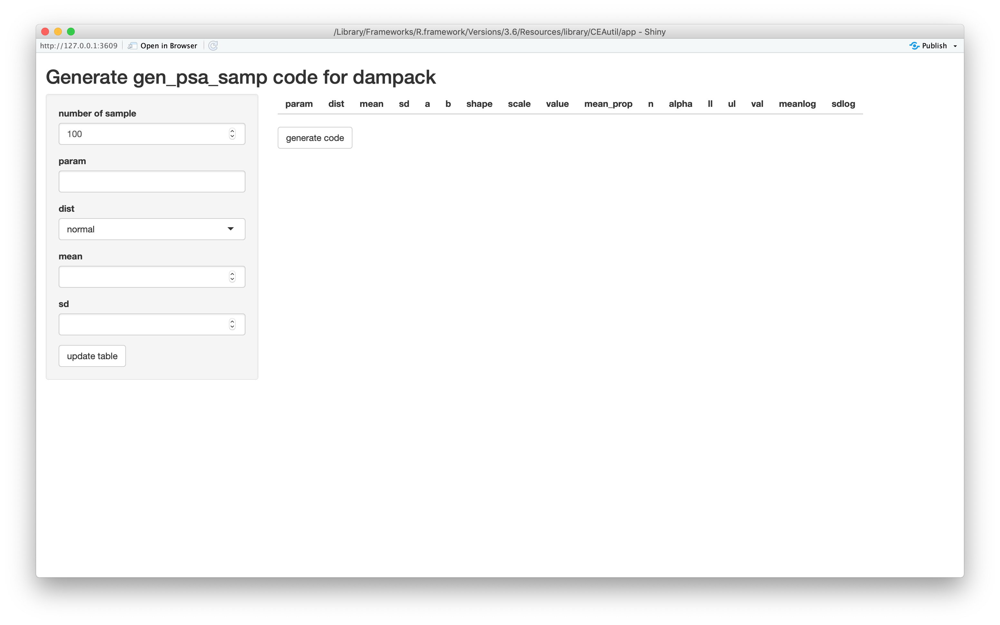
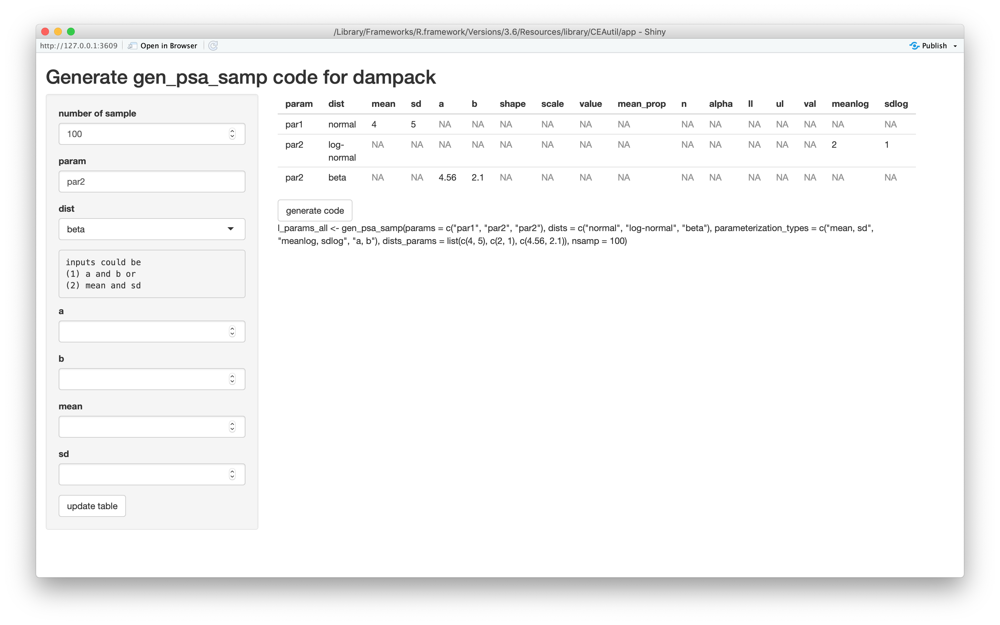

This repository is an R package for the CEA class at UMN. To directly download this package, type 

```{r}
if (!require(devtools)) install.packages("devtools")
devtools::install_github("syzoekao/CEAutil", dependencies = TRUE)
```
To have a physical copy and to edit the code, you can also clone the repository by clicking the "Clone or download" button. 



This package include three primary functionalities: (1) functions that transform the decision tree created by [Amua software](https://github.com/zward/Amua) to `R` function that can be called by [`dampack`](https://github.com/DARTH-git/dampack) CEA functions; (2) a template Markov model function and a Markov model wrapper that can be called by `dampack` CEA functions; (3) a function generate `R` code to run `gen_psa_samp()` in `dampack`. 

# Decision tree related functions

* `parse_amua_tree()`: generates the list of parameters and the body of decision tree from the `R` code exported from the Amua software. 

* `dectree_wrapper()`: takes the output object from `parse_amua_tree()` and transforms the object to a decision tree model that can be used for `run_owsa_det()`, `run_twsa_det()`, and `run_psa()` in `dampack`. 

# Markov model related functiosn

* `markov_model()`: This is the Markov model for the tanning decision problem in Ontario. This model could be regarded as a Markov model template. The function only take one strategy at a time. 

* `markov_decision_wrapper()`: This function is a wrapper function for the `markov_model()` and returns the outcomes for each strategy. 

# Generate R code for `gen_psa_samp()` in `dampack`

* `gen_psa_samp_code()`: generates the `R` code to run `gen_psa_samp()` in `dampack`. This function does not allow `bootstrap` sampling. 

You can also generate the `R` code via a built in `R shiny` app. Run the following code: 

```{r}
fpath <- system.file("app", package="CEAutil")
shiny::runApp(paste0(fpath, "/app.R"))
```

The code would launch a `Shiny` app interface. 



You can fill out the name of the paramter, the distribution, and the parameters of the distribution in the input area on the left-hand side. Each parameter that you input will generate a row in the parameter table on the right-hand side. After you finish filling out the information of all the parameters. Click the "generate code" button. The app will generate the `gen_psa_samp` code for you. 




