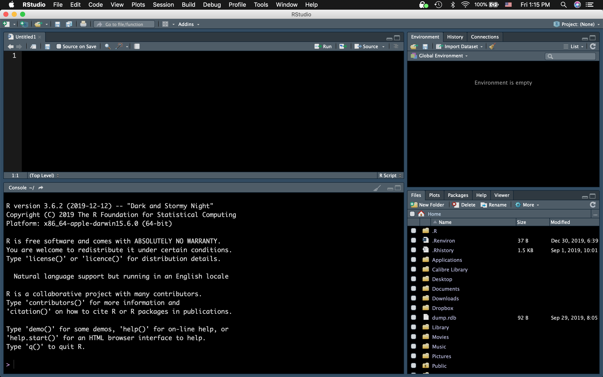
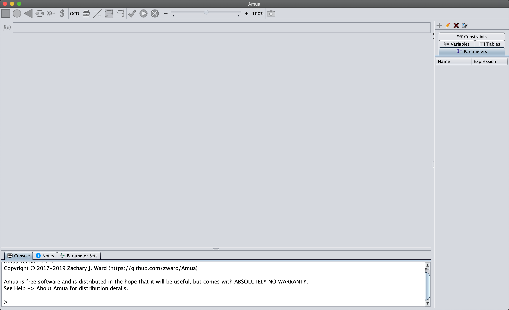
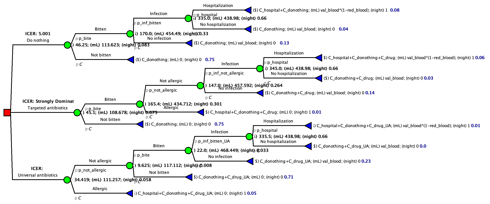
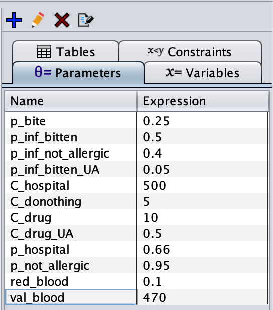
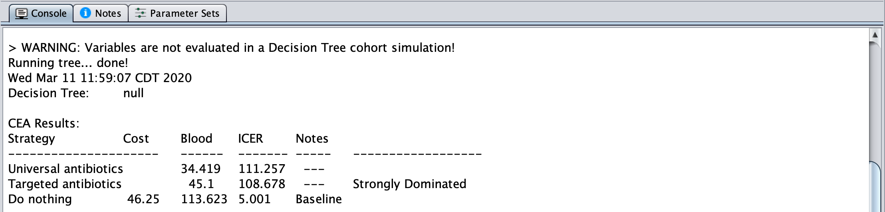
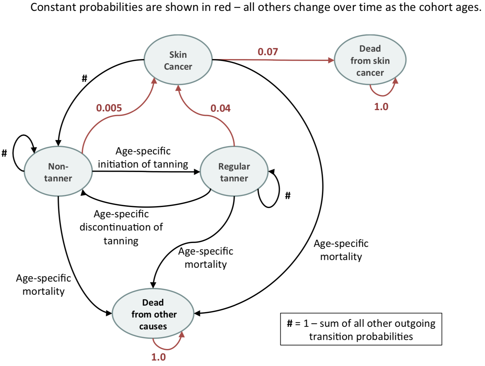

# R Basics

This lecture is to introduce the elements in R programming language that are relevant to decision model and decision analysis. 

## Agenda 

* Install R and RStudio
* Data type
* Path to your working directory
* Data input and output
* For loop
* If statement
* R function
* Plots 
* Useful packages in the class 

## Install R and RStudio

* You could install R [here](https://repo.miserver.it.umich.edu/cran/). 
  + Be aware of your operating system
  
* The original R interface is not user-friendly. We recommend using the RStudio IDE [here](https://rstudio.com/products/rstudio/download/) 

    + Just download the free version!
  
* Open RStudio 


## Data type 

* In this class, we will mainly use `vector`, `matrix`, `array`, `list`, and `data.frame`. 
* These types of data are used intensively in constructing Markov model and in the package of decision analyses

### Vector 

```{r}
x1 <- c(3, 1, 4)
print(x1)

x2 <- c(2, 7, 1)
print(x1 + x2)

future_human <- c("earther", "martian", "belter")
print(future_human)
```

* You could combine different type of vectors
    
    + This operation coerces the data type into text

```{r}
x1_and_future_human <- c(x1, future_human)
print(x1_and_future_human)
```

* We often create the initial status in the Markov model using vector
  
    + The distribution of healthy, sick, and dead in a population 
    + You can name the elements in the vector

```{r}
v_init <- c(0.9, 0.09, 0.01)
names(v_init) <- c("healthy", "sick", "dead")
print(v_init)
print(sum(v_init))
```

* Access an element(s) in a vector 

```{r}
print(v_init[2])
print(v_init["sick"])

print(v_init[2:3])
print(v_init[c("sick", "dead")])
```

### Matrix & Array

* Matrix is defined with two dimension using the numbers of columns and rows

```{r}
x <- matrix(c(1, 0, 0, 
              0.8, 0.2, 0, 
              0, 0, 1), 
            byrow = T, nrow = 3)
print(x)
```

* We often use this as the basis of transition matrix in Markov model or use this to trace the outcomes over time. 
* You could also provide the names to the columns and rows

```{r}
rownames(x) <- colnames(x) <- c("healthy", "sick", "dead")
print(x)
```

* We can access the value of a specific cell

```{r}
print(x[2, 2])
print(x["sick", "sick"])
```

* Matrix multiplication is often used in Markov models. For example, we can multiply the initial state with the transition matrix
 
    + `v_init` is not a matrix. Thus, we use `t()` to convert `v_init` into a $1 \times 3$ matrix. 
    + `%*%` is the symbol for matrix multiplication in `R`

```{r}
print(t(v_init) %*% x)
```

* If transition probabilities in the transition matrix vary with time, `array()` is more useful. 
* `array()` can be seen as a data type that stores multiple matrices all at once. 
* Let's create two transition matrices and combine them into an array. 

```{r}
tr1 <- x
tr2 <- matrix(c(0.9, 0.1, 0, 
                0.7, 0.2, 0.1, 
                0, 0, 1), 
              byrow = T, nrow = 3, 
              dimnames = list(c("healthy", "sick", "dead"), 
                              c("healthy", "sick", "dead")))
```

* Create an array with dimension $3 \times 3 \times 2$

```{r}
tr_array <- array(dim = c(3, 3, 2), 
                  data = cbind(tr1, tr2), 
                  dimnames = list(c("healthy", "sick", "dead"), 
                              c("healthy", "sick", "dead"), 
                              c(1, 2)))
print(tr_array)
```

* We can access each transition matrix by proper indexing 

```{r}
print(tr_array[ , ,  1])
print(tr_array[ , ,  2])
```

* We can also access a specific value of the transition array

```{r}
print(tr_array[1, 2, 1])
```

* Similarly, we can perform calculation using a slice of array

```{r}
v_time2 <- t(v_init) %*% tr_array[ , , 1]
print(v_time2)

v_time3 <- v_time2 %*% tr_array[ , , 2]
print(v_time3)
```

### List 

* List can combine different types of data without affecting the data type. 

```{r}
temp_ls <- list(future_human = future_human, v_init = v_init, tr_array = tr_array)
print(temp_ls)
```

* There are two approaches to access an element in the list 

```{r}
print(temp_ls[[1]])
print(temp_ls$v_init)
```

* You can access a specific element in an element of a list

```{r}
print(temp_ls$tr_array[, , 1])
```

### `data.frame`

* If your Stats or Biostats classes use `R`, you probably have encountered `data.frame()` very frequently.
* Let's create a `data.frame()`

```{r}
profile <- data.frame(name = c("Amos", "Bobbie", "Naomi"), 
                      human_type = c("earther", "martian", "belter"), 
                      height = c(1.8, 2.1, 1.78))
print(profile)
```

* `data.frame()` is essentially a named list of vectors with the same length. 

```{r}
typeof(profile)
length(profile$name) 
length(profile$human_type)
length(profile$height)
```

* Access elements in `data.frame()`

```{r}
profile[profile$name == "Bobbie", ]
profile[profile$name == "Bobbie", "height"]
```

## Path to your working directory

* It is recommended to create a folder/directory for each of your project. 
* You would store all your R script, data, and outputs in the directory. 
* Whenever you are working on a project, set up your working directory first. 

```{r, eval=FALSE}
setwd("path-to-your-project-folder")
setwd("zoeslaptop/Documents/CEA/introR/")
```

  * The `setwd()` function sets up your working directory and allows you to access the files and folders in the working directory much easier. 
  * For example, I want to run the R script `hello.R` in the `Rscript/` folder in my working directory. 
    
    * Without setting up the working directory first, I have to type `source("zoeslaptop/Documents/CEA/introR/Rscript/hello.R")`
    * If setting up the working directory first, I can run the script by this command: `source("Rscript/hello.R")`
    
  * The format of path could be slightly different between windows, unix, and linux

* RStudio provides a very nice feature `project`. A project sets up the working environment automatically. Whenever you open a project, you are in the working directory to a specific project alreadly!

  * You could find more information about creating an R project and other useful tip [here](https://zerotorhero.files.wordpress.com/2012/12/data-and-projects-in-r-studio.pdf). 

## Data input and output

* You could load/read or save/write your own datasets. 
* R data format family:

  * `.RData`, `.rda`, and `.rds`. 
  * You can retrieve the information in these data objects using functions `load()` and `readRDS()`
  * You can save the data using `save()` and `saveRDS()`. 
  
* It is common that you might encounter other data types (e.g., `.csv` and `.txt`) or even data format for other software (e.g., Stata and SAS). 

  * To read or save other types of data, you could find the information [here](https://bookdown.org/lyzhang10/lzhang_r_tips_book/how-to-read-data-into-r.html) and [here](https://mgimond.github.io/ES218/Week02b.html). 

## Loops 

* Loops help repeat routine or calculations. 
* Let's watch a video from Codecademy. 

```{r echo = FALSE, message = FALSE, warning = FALSE}
# library("htmltools")
library("vembedr")

embed_url("https://www.youtube.com/watch?v=wxds6MAtUQ0")
```

* Components included in loops 

    + A well-defined routine/process
    + When to start
    + When to stop 

* The most used loop is `for` loop in many decision models. The structure follows: 

```{r, eval = FALSE}
for (i in c(start : end)) {
  # Routine / Process
}
```

**Example 1**: Fibonacci sequence is the sum of the two preceding numbers. We start the sequence from 0 and 1. What are the first 10 Fibonacci numbers? (0 and 1 are the 1st and 2nd Fibonacci number, respectively.)

* Note that we want to get all the 10 Fibonacci numbers. We need to create a vector to store all the 10 numbers. 

    + We already know the first two values. Thus, we replace the first two values in the `fib_vec`. 

```{r}
fib_vec <- rep(0, 10)
fib_vec[c(1:2)] <- c(0, 1)
print(fib_vec)
```

* The start point and end point are 3 and 10 because we already knew the first two Fibonacci numbers. 

```{r}
for (i in c(3 : 10)) {
  fib_vec[i] <- fib_vec[i - 1] + fib_vec[i - 2]
}

print(fib_vec)
```


**Example 2**: In year 2400, there are 3000 martians in Mars colony. The growth rate of the martian population follows this formula $0.05 P(t) \bigl(1 - \frac{P(t)}{10000})$. What is the population size in year 2500? 

* Note that the growth rate depends on the population size at each year. 
* You can use for loop to calculate the population size at each year. 

```{r}
# initialize a vector of population size over the next 100 years
popsize <- rep(3000, 100)

# Calculate 
for (t in c(1 : 100)) {
  popsize[t + 1] <- popsize[t] + 0.05 * popsize[t] * (1 - popsize[t] / 100000)
}

popdf <- data.frame(year = c(2400:2500), 
                    popsize = popsize)
print(popdf[popdf$year == 2500, ])
```


```{r, echo = FALSE}
library(ggplot2)

ggplot(popdf, aes(year, popsize)) + 
  geom_line(color = "dodgerblue", size = 1.5) + 
  theme_bw()
```


## If statement

* If statement is used when you just want to execute the chunk of the code if a certain condition is met. 
* The structure follows 

```{r, eval = FALSE}
if (condition1) {
  # Execute some code 
} else if (condition2) {
  # Execute some code
} else {
  # Execute some code
}
```

* `else if` and `else` are not always needed. 
* Before we jump into examples of if statement, let's take a look at how to write the condition in the `if()`

```{r}
"yoda" == "windu"

Jedi <- c("yoda", "windu", "kenobi")
"yoda" %in% Jedi
```

* If statement only execute the code when the condition in `if()` is true.

```{r}
Mandalorian <- c("satine", "sabine", "jango")

x <- "yoda"

if (x %in% Jedi) {
  print("May the force be with you!")
} else if (x %in% Mandalorian) {
  print("This is the way!")
} else {
  print("Hello, world!")
}
```

* Note that R is case sensitive. If you type `"Yoda"`, you get `"Hello, world!"`

## R function

* As your code grows, copying the entire decision model many times is annoying. 
* Consider programming some routines / processes in a function if you will reuse the routines / processes many times. 
* There are many example functions in `R`, e.g., `lm()`, `sum()`, `print()`, etc. 
* The primary components of an `R` function are the `body()`, `formals()`, and `environment()`. We often want to return the results from the function. 

    + `body()`: the code inside the function. 
    + `formals()`: the input arguments. 
    + `environment()`: where the variables in the function are located. 
    + `return()`: return the relevant output
    

```{r}
speak <- function(x) {
  Jedi <- c("yoda", "windu", "kenobi")
  Mandalorian <- c("satine", "sabine", "jango")

  if (x %in% Jedi) {
    say <- "May the force be with you!"
    membership <- "Jedi"
  } else if (x %in% Mandalorian) {
    say <- "This is the way!"
    membership <- "Mandalorian"
  } else {
    say <- "Hello, world!"
    membership <- "Not Jedi or Mandalorian"
  }
  return(list(say = say, membership = membership))
}

formals(speak)
body(speak)
environment(speak)
```

* What is the result return from the function? 

```{r}
speak("jango")
```

* In this class, we might ask you to change some part of the code in a markov model function. 

**Question**: How would you program the Matian population growth in a function? What are the input arguments? What are the results return from the function? 

## Plots

#### Histogram

* Showing the distribution of a variable 

```{r}
x <- rnorm(1000, 0, 1) # draw 1000 samples from a normal distribution
print(mean(x))
print(sd(x))

hist(x, freq = F, col = "gray")
```

#### Scatter plots

* Inspect the correlation between two variables

```{r}
library(CEAutil)
data(worldHE)

print(head(worldHE))
```

* Only focus on the data in 2010
```{r}
worldHE2010 <- worldHE[worldHE$Year == 2010, ]
```

```{r}
hist(worldHE2010$LEyr, main = "Life expectancy in 2010")
hist(worldHE2010$HealthExp, main = "Health expenditure in 2010 per capita")
```

```{r}
plot(worldHE2010$HealthExp, worldHE2010$LEyr, ylim = c(70, 90), 
     xlab = "health expenditure", ylab = "life expectancy")
text(worldHE2010$HealthExp, worldHE2010$LEyr, labels = worldHE2010$Entity, cex = 0.8)
```

[source](https://ourworldindata.org/the-link-between-life-expectancy-and-health-spending-us-focus)

#### Line plots

* What is the trend of health expenditure in the US 1970-2015?

```{r}
worldHE_US <- worldHE[worldHE$Entity == "United States" & worldHE$Year >= 1970 & worldHE$Year <= 2015, ]
# adding lines: UK's expenditure at the same time period
worldHE_UK <- worldHE[worldHE$Entity == "United Kingdom" & worldHE$Year >= 1970 & worldHE$Year <= 2015, ]

plot(worldHE_US$Year, worldHE_US$HealthExp, type = "l", col = "red", 
     ylab = "expenditure", xlab = "year", ylim = c(500, 10000))
lines(worldHE_UK$Year, worldHE_UK$HealthExp, col = "royalblue")
legend("topleft", legend=c("US", "UK"),
       col=c("red", "royalblue"), lty = 1, cex = 0.8)
```

* There is a great package to help you make better plots! `ggplot2`

## Useful packages in the class 

* The packages that we will use in the class include: `ggplot2`, `dampack`, and `CEAutil`. 
* Here are the code to install these packages. 

```{r message = FALSE, warning = FALSE}
if(!require(ggplot2)) install.packages("ggplot2")
if(!require(devtools)) install.packages("devtools")
if(!require(remotes)) install.packages("remotes")
if(!require(dampack)) remotes::install_github("DARTH-git/dampack", dependencies = TRUE)
if(!require(CEAutil)) remotes::install_github("syzoekao/CEAutil", dependencies = TRUE)
```


# Decision tree

## Agenda 

* Introduction of Amua
* Creating a decision tree using Amua
* Example
* Exporting Amua decision tree to R script
* Prepare the R decision tree from Amua for further analyses

For a simple decision tree, we can draw the tree easily. As the decision tree grows, there is software helping you draw the tree such as TreeAge and Amua. In this class, we use [Amua](https://github.com/zward/Amua) because it is free. We will show how to use Amua to build a decision tree and export the tree to R script for CEA analysis. 

## Install Amua

Follow the instruction [here](https://github.com/zward/Amua/wiki/Getting-Started) to install Amua. Be aware of the difference between Mac and Windows users! After you install Amua, remember where you store the software. 

## Create a decision tree 

### Open the `Amua.jar`. 



### Decision, chance, terminal nodes, and decision tree

* Amua includes three type of nodes: decision, chance and terminal nodes in a decision tree. 

<video width="600" height="400" controls>
  <source src="Figure/Amua_basics1.mp4" type="video/mp4">
</video>

### Parameterization

* While you can hard code all the parameter values in each branch or terminal node, you could parameterize the input parameters (especially the parameters that might vary). 

<video width="600" height="400" controls>
  <source src="Figure/Amua_basics2.mp4" type="video/mp4">
</video>


### Adding more outcomes

* You could add multiple outcomes of interest at the terminal nodes. 
* Sometimes we might be interested not only in cost but also in epidemiological outcomes

<video width="600" height="400" controls>
  <source src="Figure/Amua_basics3.mp4" type="video/mp4">
</video>

### Change analysis

* Change your analysis type to cost-effectiveness analysis. 
* Remember to select the cost and effectiveness outcomes. 
* Also select the baseline strategy. 

<video width="600" height="400" controls>
  <source src="Figure/Amua_basics4.mp4" type="video/mp4">
</video>

### Save the model and export the tree to R code

* We then save the model and export the tree structure to R code. 
* Notice that Amua created a folder, called `temp_Export/`. 
* In this folder, there are two `.R` files: `main.R` and `functions.R`. 
* The body of the decision tree model is in `main.R`. 

<video width="600" height="400" controls>
  <source src="Figure/Amua_basics5.mp4" type="video/mp4">
</video>


## Example

Dracula is preparing for a spring break party tonight. But there’s one final decision that Dracula is struggling with. Being a vampire, he intends to bite and suck the blood of some of his guests at the party (about 25% of them, by his best estimate). While being bitten by a vampire won’t turn his guests into vampires or zombies, like some horror movies might suggest, there is a 50% chance that a vampire bite results in a rather severe bacterial infection, of which 66% of cases require hospitalization for an average of 1 night.

Being a gracious host, Dracula is considering different ways of administering antibiotic prophylaxis to his guests to reduce their risk of infection. One option is to administer the antibiotics to his victim‐guests just before he bites them – this would reduce the risk of a vampire bite infection by 20%. However, the antibiotics can be even more effective, reducing the risk of infection by 90%, if administered at least 30 minutes before being bitten. To achieve this, Dracula is considering putting the antibiotics into the drinks served at the party to ensure that his guests are all properly dosed before he bites his victims. But this means that all his guests would be exposed to the antibiotics (not just those he intends to bite), and he knows that about 5% of people are severely allergic to these antibiotics and would require immediate hospitalization if exposed. Dracula is therefore also considering not administering antibiotic prophylaxis at all to avoid this harm.

However, all the healthy blood doesn't come without cost. This party will cost Dracula \$1000 for a total of 200 guests (an average of \$5 per guest). In addition, Dracula expects the cost of antibiotic to be \$10 for each guest he bites. If Dracula decides to administer the antibiotics in all the drinks served at the party, the total cost of antibioitics is expected to be $100 (Dracula gets discount for buying a large batch of antibiotics!). Also, Dracula is willing to pay for the cost of hospitalization for any guest who experience bacteiral infection due to his bites because he feels responsible. The cost of hospitalization per person per night is \$500. Dracula expects to get an average of 470 mL healthy blood by biting a guest. However, if the guest ends up hospitalized due to bacterial infection, the healthy blood that Dracula can get is reduced by 10%. 
Dracula hopes that you can help him determine which strategy he should choose.

Think about the following quesitons: 

1. List out Dracula's strategies. 
2. What are the potential outcomes for Dracula's party? 
3. Draw the decision tree for Dracula's party. 

You can build a decision tree via Amua. 

* The tree structure



* The parameters

{width=250px}

* The CEA outcomes



## Wrapper function for decision tree exported from Amua

* The decision tree created in Amua can be exported to R. 
* However, the R script created by Amua is not easy to use for advance CEA analysis (e.g., PSA, one/two-way sensitivity analysis, EVPI, etc.). 
* We created some wrapper functions to reshape the R script from Amua. This transformation of code allows us to do further analysis using other packages in R. 
* Install the package using the following code. 

```{r message = FALSE, warnings = FALSE}

if(!require("remotes")) install.packages("remotes")
if(!require("dplyr")) install.packages("dplyr")
if(!require("CEAutil")) remotes::install_github("syzoekao/CEAutil", dependencies = TRUE)
if(!require(dampack)) remotes::install_github("DARTH-git/dampack", dependencies = TRUE)

library(CEAutil)
```

* We will use two functions from the package to convert the R script exported from Amua. 

  1. `parse_amua_tree()`: 

This function only takes an input argument, the path to the `main.R` file of the Amua decision model. The function returns a list of outputs. Output 1 `param_ls` is a list of input parameters with basecase values used in Amua. Output 2 `treefunc` is the R code of the Amua decision model formatted as text. 


```{r class.source = 'fold-show'}
treetxt <- parse_amua_tree("AmuaExample/DraculaParty_Export/main.R")

print(treetxt$param_ls)
```


  2. `dectree_wrapper()`: 

We use the two outputs from the `parse_amua_tree()` as the input arguments in the `dectree_wrapper()`. The input arguments in the wrapper function include `params_basecase`, `treefunc`, and `popsize`. `params_basecase` takes a list of named input parameters. `treefunc` takes the text file organized by the `parse_amua_tree()`. `popsize` is defaulted as 1 but you could change your population size. 

```{r class.source = 'fold-show'}
param_ls <- treetxt[["param_ls"]]
treefunc <- treetxt[["treefunc"]]
```

* Expected cost per person

```{r}
tree_output <- dectree_wrapper(params_basecase = param_ls, treefunc = treefunc, popsize = 1)
print(tree_output)
```

* Expected cost of 200 guests

```{r}
tree_output <- dectree_wrapper(params_basecase = param_ls, treefunc = treefunc, popsize = 200)
print(tree_output)
```

## Calculate ICERs 

```{r}
library(dampack)
dracula_icer <- calculate_icers(tree_output$Cost,
                                tree_output$expectedBlood,
                                tree_output$strategy)
print(dracula_icer)
```

* Create an ICER plot

```{r}
plot(dracula_icer, effect_units = "mL")
```


## Change parameter values

* Many of the parameters are organized as a variable in the decision tree. We can easily see how the cost and effectiveness vary with changes of parameters of interest.

**Example 1.** Dracula has been starved over the long cruel winter in Minnesota. The Spring break is the first time that his guests are willing to come to his party in several months. Therefore, Dracula is going to seize the chance to bite as many guests as possible. The probability that he bites a guest is now increased to 50%. What are the cost and effectiveness of each strategy? 

```{r}
param_ls$p_bite <- 0.5

tree_output <- dectree_wrapper(params_basecase = param_ls, treefunc = treefunc, popsize = 200)

print(tree_output)
```

* ICER & ICER plot

```{r}
dracula_icer <- calculate_icers(tree_output$Cost,
                                tree_output$expectedBlood,
                                tree_output$strategy)
print(dracula_icer)
plot(dracula_icer, effect_units = "mL")
```


**Example 2.** The cost of hospitalization due to bacterial infection varies from guest to guest depending on the healthcare that a guest has. Overall, the cost of hospitalization has a mean of \$500 with a standard deviation \$300 following a gamma distribution. What are the mean cost and effectiveness of the party across all 200 guests? 

* Generate 200 samples of the cost of hospitalization from gamma distribution

```{r message = FALSE, warning = FALSE}
require(dampack)

C_hospital <- gen_psa_samp(params = c("C_hospital"),
                           dists = c("gamma"),
                           parameterization_types = c("mean, sd"),
                           dists_params = list(c(500, 250)),
                           nsamp = 200)

cat("mean and sd are", c(mean(C_hospital$C_hospital), sd(C_hospital$C_hospital)), ", respectively.")

hist(C_hospital$C_hospital, main = "histogram", xlab = "values", ylab = "frequency", col = "gray", border = F)
abline(v = mean(C_hospital$C_hospital), col = "firebrick", lwd = 3)
text(mean(C_hospital$C_hospital) + 50, 30, "mean\ncost", col = "firebrick", font = 2)
```

* Calculate the expected cost and effectiveness for each sample of cost 

```{r}
tree_vary <- dectree_wrapper(params_basecase = param_ls, 
                             treefunc = treefunc, 
                             vary_param_samp = C_hospital)
```

* Let's take a look at some elements in the tree_vary output

```{r}
print(names(tree_vary))
print(head(tree_vary$param_samp))
print(head(tree_vary$expectedBlood))
print(head(tree_vary$Cost))
```

* The mean cost 

```{r}
print(summary(tree_vary$Cost))
```

* How the expected cost differs between strategy? 

```{r}
hist(tree_vary$Cost$Donothing, col = rgb(0.5, 0.5, 0.5, 0.6), border = F,
     main = c("Cost of hospitalization"),
     xlab = "Cost")
hist(tree_vary$Cost$Targetedantibiotics, col = rgb(0.2, 0.2, 0.8, 0.5), border = F, add = T)
hist(tree_vary$Cost$Universalantibiotics, col = rgb(0.3, 0.8, 0.2, 0.5), border = F, add = T)
legend("topright", c("do nothing", "targeted", "universal"),
       col = c(rgb(0.5, 0.5, 0.5, 0.6), rgb(0.2, 0.2, 0.8, 0.5), rgb(0.3, 0.8, 0.2, 0.5)),
       pch = 15, pt.cex = 2)
```


# Markov model

## Agenda

* General Markov model coding structure
* Follow the coding steps using an example
* The template of Markov model function 
* Consideration of strategies 
* Prepare your Markov model for further analyses

## General Markov model coding structure

* We will show how to code a Markov model step by step. 
* In general, we follow this structure: 

```{}
markov_model <- function(l_param_all,
                         strategy = NULL) {
  #### 1. Read in, define, or transform parameters if needed
  
  #### 2. Create the transition probability matrices using array
  
  #### 3. Create the trace matrix to track the changes in the population distribution 
  #### through time. You could also create other matrix to track different outcomes,
  #### e.g., costs, incidence, etc.
  
  #### 4. Get outputs
  
  #### 5. Return the relevant results
}
```

* Then we write this process into a function `markov_model()`

## Example 

The Canadian province of Ontario is considering a province-wide ban on indoor tanning as a means of preventing skin cancer, with a focus on young women. The Ontario Ministry of Health has just finished a large observational study on tanning behaviors and skin cancer incidence among women in Ontario to inform their decision.

In their surveillance study, they found that skin cancer risks differ substantially for individuals who visit tanning salons regularly (“regular tanners”) and those who do not ("non-tanners"). The annual risk of skin cancer was 4% for regular tanners vs. 0.5% for non-tanners. (Assume that skin cancer risk depends only on current tanning behavior and not on tanning history).

The Ministry of Health also studied tanning behaviors. They estimated the annual probability of a non-tanner becoming a regular tanner, by age, among women. This probability begins increasing around age 12, peaks at age 24 and then begins to decrease. They also estimated the rate of a regular tanner becoming a non-tanner. This probability is low until age 30, after which it increases with age. These data are summarized in the dataset `ONtan` in the `CEAutil` package.

Skin cancer resolves within one year of diagnosis, with 7% of cases resulting in death. Those who recover following a skin cancer diagnosis nearly all quit tanning, though they re-initiate indoor tanning at the same rate as their peers who have not experienced skin cancer.

The Ontario Ministry of Health is considering an indoor tanning ban for those 18 years of age and younger (reducing the rate of tanning initiation to zero among this age group). They are also considering a full indoor tanning ban, which would reduce the rate of tanning initiation to zero for everyone in Ontario. 

However, indoor tanning ban would result in reduced demand for indoor tanning and decrease the number of employees hired in these facilities (there are currently about 1000 employees in the industry). Indoor tanning ban among women younger than 18 year-old would reduce the employmenet by 10% in the industry. A full indoor tanning ban would reduce the employmenet by 80%. We assume that the average annual salary of an employee is 28,000 Canadian dollars. The Ontario Ministry of Health would like to conduct cost-effectiveness analysis for the health benefit over the lifetime of a cohort of 10-year-old girls by considering the cost. The Ministry of Health does not wish to discount outcomes.

1. Draw a Markov model diagram of tanning behavior and skin cancer that the Ontario Ministry of Health could use to evaluate their tanning policies in terms of the desired outcomes. Use a yearly time step. Include the following states: "Non-tanners", "Regular tanners", "Skin cancer", "Dead from skin cancer", and "Dead from other causes". Label all transition probabilities and indicate which are changing over time.

2. Calcuate the remaining life-expectancy of a 10-year-old girl under each strategy.

### Step 0. Model setup 

Before doing any actual coding: 

1. Draw your Markov model diagram
2. Figure out your parameters 

    + Which are fixed? 
    + Which are time varying? 
    + Do you have parameters that require calibration? 
      
        * This is not relevant to our example here but it might happen in your other projects.

3. What is the time horizon? 
  
    + 100 years

4. What is the cycle length? 
    
    + annual time step

5. Draw your own Markov diagram



### Step 1. Set up parameters, data, and variables required

* We start with setting up parameter values, function, or transformation. 
* Provide your parameter table: 

```{r, echo = FALSE, message = FALSE, warning = FALSE}
library(kableExtra)

input_table <- data.frame("parameter code" = c("p_init_tan", "p_halt_tan", "p_nontan_to_cancer", "p_regtan_to_cancer", "p_cancer_to_dead", "p_mort", "n_worker", "salary", "target_red", "universal_red"), 
                          "definition" = c("probability of initiating tanning", "probability of discontinuing tanning", "probability of having skin cancer among non-tanners", "probability of having skin cancer among regular tanners", "probability of cancer-specific death", "probability of natural death", "number of workers", "average salary of tanning workers", "reduction of workers under targeted ban", "reduction of workers under universal ban"), 
                          "data type" = c("table", "table", "constant", "constant", "constant", "table", "constant", "constant", "constant", "constant"))

kable(input_table, col.names=c("parameter code", "definition", "data type")) %>% 
  kable_styling(full_width = F, position = "center") 
```

* You could find the tanning behavior and the life table in the `CEAutil` package. 

```{r}
library(CEAutil)

data(ONtan)
ltable <- ONtan$lifetable
behavior <- ONtan$behavior

print(head(ltable))
print(head(behavior))
```

* For the constant parameters: 

```{r}
p_nontan_to_cancer <- 0.005
p_regtan_to_cancer <- 0.04
p_cancer_to_dead <- 0.07
n_worker <- 1000
salary <- 28000
target_red <- 0.1
universal_red <- 0.8
```

* In addition, we have other required variables 

    + timehorizon (`n_t`)
    + names of each health state (`state_names`)
    + initial status (`v_init`)

```{r}
n_t <- 100 
state_names <- c("nontan", "regtan", "cancer", "deadnature", "deadcancer")
v_init <- c(1, 0, 0, 0, 0)
```

* These input parameters are often defined **outside** the `markov_model()` function. In this model framework, we use `list()` to combine all the parameters, data, and variables defined beforehand. We provide the name for each the element in the list. 

```{r}
l_param_all <- list(p_nontan_to_cancer = 0.005,
                    p_regtan_to_cancer = 0.04,
                    p_cancer_to_dead = 0.07, 
                    n_worker = 1000, 
                    salary = 28000, 
                    target_red = 0.1,
                    universal_red = 0.8, 
                    ltable = ltable,
                    behavior = behavior, 
                    state_names = c("nontan", "regtan", "cancer", "deadnature", "deadcancer"),
                    n_t = 100,
                    v_init = c(1, 0, 0, 0, 0))
```

* In the function, we start with some basic calculation and transformation of the input parameters, data, and variables that will be used in the Markov model. 

```{r, eval = FALSE}
#### 1. Read in, set, or transform parameters if needed
# We need the age index for matching values of the lifetable and behavior data.
ages <- c(10 : (10 + n_t - 1))

# We extract the probability of natural death age 10-110 from the lifetable. 
p_mort <- ltable$qx[match(ages, ltable$age)]

# We modify the values of tanning behavior based on strategy of interest.
if (strategy == "targeted_ban") {
  behavior$p_init_tanning[behavior$age <= 18] <- 0
}
if (strategy == "universal_ban") {
  behavior$p_init_tanning <- 0
}

# We extract the tanning behavior at age 10-110 from the behavior data 
p_init_tan <- behavior$p_init_tanning[match(ages, behavior$age)]
p_halt_tan <- behavior$p_halt_tanning[match(ages, behavior$age)]

# We get the number of health states based on the length of the string vector, state_names
n_states <- length(state_names)
```

```{r, echo = FALSE, message = FALSE, warning = FALSE}
ages <- c(10 : (10 + n_t - 1))

# We extract the probability of natural death age 10-110 from the lifetable. 
p_mort <- ltable$qx[match(ages, ltable$age)]

# # We modify the values of tanning behavior based on strategy of interest.
# if (strategy == "targeted_ban") {
#   behavior$p_init_tanning[behavior$age <= 18] <- 0
# }
# if (strategy == "universal_ban") {
#   behavior$p_init_tanning <- 0
# }

# We extract the tanning behavior at age 10-110 from the behavior data 
p_init_tan <- behavior$p_init_tanning[match(ages, behavior$age)]
p_halt_tan <- behavior$p_halt_tanning[match(ages, behavior$age)]

# We get the number of health states based on the length of the string vector, state_names
n_states <- length(state_names)
```

### Step 2. Create the transition probability array 

* A transition probability matrix contains the transition probability from one health state to another state. 

```{r, echo = FALSE}
transit_matrix <- matrix(c(0.1, 0.2, 0.7, 
                           0.5, 0.1, 0.4, 
                           0.7, 0, 0.3), byrow = T, ncol = 3, 
                         dimnames = list(c("state1", "state2", "state3"), 
                                         c("state1", "state2", "state3")))
print(transit_matrix)
```

* In many of our applications, individuals transit from the row state to the column state. Each row should sum up to 1. 

```{r}
print(rowSums(transit_matrix))
```

* The transition probability array can contain more than one transition matrix. Because the behavior and mortality vary over time. The transition matrix is different from year to year. Thus, we create a transition array with the following dimension $n\_state \times n\_state \times n\_t$. 

```{r}
tr_mat <- array(0, dim = c(n_states, n_states, n_t),
                dimnames = list(state_names, state_names, ages))
```

* We initiate the transition array with 0 because most transition probabilities are zeros. 
* Then we modify the transition probabilities for each origin state. 

```{r}
# 1. Fill out the transition probabilities from non-tanner to other states
tr_mat["nontan", "regtan", ] <- p_init_tan
tr_mat["nontan", "cancer", ] <- p_nontan_to_cancer
tr_mat["nontan", "deadnature", ] <- p_mort
tr_mat["nontan", "nontan", ] <- 1 - p_init_tan - p_nontan_to_cancer - p_mort

# 2. Fill out the transition probabilities from regular tanner to other states
tr_mat["regtan", "nontan", ] <- p_halt_tan
tr_mat["regtan", "cancer", ] <- p_regtan_to_cancer
tr_mat["regtan", "deadnature", ] <- p_mort
tr_mat["regtan", "regtan", ] <- 1 - p_halt_tan - p_regtan_to_cancer - p_mort

# 3. Fill out the transition probabilities from skin cancer to other states.
#    Be careful that this is a tunnel state. Therefore, there is no self loop.
tr_mat["cancer", "deadcancer", ] <- p_cancer_to_dead
tr_mat["cancer", "deadnature", ] <- p_mort
tr_mat["cancer", "nontan", ] <- 1 - p_cancer_to_dead - p_mort

# 4. Fill out the transition probabilities for cancer specific death (this is an absorbing state!!)
tr_mat["deadcancer", "deadcancer", ] <- 1

# 5. Fill out the transition probabilities for natural death (this is an absorbing state!!)
tr_mat["deadnature", "deadnature", ] <- 1
```

* Let's see two slice of the transition array

```{r}
print(tr_mat[, , "20"])
```

```{r}
print(tr_mat[, , "50"])
```

* Check whether the transition array meets the criteria of transition matrix

```{r}
# Check whether the transition matrices have any negative values or values > 1!!!
if (sum(tr_mat > 1) | sum(tr_mat < 0)) stop("there are invalid transition probabilities")

# Check whether each row of a transition matrix sum up to 1!!!
if (any(rowSums(t(apply(tr_mat, 3, rowSums))) != n_states)) stop("transition probabilities do not sum up to one")
```

### Step 3. Create the trace matrix and outcome matrix 

* Initialize the trace matrix and replace the first row with the initial state (`v_init`)

```{r}
#### 3. Create the trace matrix to track the changes in the population distribution through time
#### You could also create other matrix to track different outcomes,
#### e.g., costs, incidence, etc.
trace_mat <- matrix(0, ncol = n_states, nrow = n_t + 1,
                    dimnames = list(c(10 : (10 + n_t)), state_names))
# Modify the first row of the trace_mat using the v_init
trace_mat[1, ] <- v_init
```

* If you are interested in tracking other outcomes, initialize an empty matrix here. 

```{r}
# Suppose that we want to track the cost of having skin cancer for a year
trace_cost <- rep(0, n_t)
```

### Step 4. Compute the Markov model over time

* We use `for()` loop to iterate the calculation through time. 

```{r}
#### 4. Compute the Markov model over time by iterating through time steps
for(t in 1 : n_t){
  trace_mat[t + 1, ] <- trace_mat[t, ] %*% tr_mat[, , t]
}
```

### Step 5. Organize outputs

* The outcome in this example is "expected life years" (`LE`) and total cost due to laying off workers in the industry. 


    + Calculate the cost associated with each strategy
    + Calculate the sums by each row for the remaining columns. 
    + Calculate the life expectancy by summing up all the values. 


* We organize the output in a `data.frame` with the strategy in the first column and `LE` as the second column. 
* You could add more columns to the `data.frame` if you have more outcomes of interest (e.g., cost) 

```{r, eval = F}
#### 5. Organize outputs
# Cost
tot_cost <- 0 # if there is no tanning ban
if (strategy == "targeted_ban") {
  tot_cost <- n_worker * target_red * salary
}
if (strategy == "universal_ban") {
  tot_cost <- n_worker * universal_red * salary
}

# Life expectancy
LE <- sum(rowSums(trace_mat[, !grepl("dead", state_names)])) - 1

# Output table
output <- data.frame("strategy" = strategy,
                     "LE" = LE,
                     "Cost" = tot_cost)
```

### Step 6. Return the relevant outputs

* Finally, return the outputs/results from the function. 

```{r, eval = FALSE}
return(output)
```

* You could return a list of outputs. For example, if you want to also return the trace matrix, you could do this: 

```{r, eval = FALSE}
return(list(output = output, trace = trace_mat))
```

## The template Markov model function

* You could find the template Markov model function in the `CEAutil` package. 
* You can modify the function for your project. 

`r text_spec("Need discussion!! Should we illustrate how to calculate cost?", background = "#D05A6E", color = "white", bold = T)`

```{r}
library(CEAutil)

print(markov_model)
```

## Strategies 

* Notice that the `markov_model()` function has another argument `strategy`. 
* Specifying different strategy produces different life expectancy. 
* In our example, there are three types of strategies: "null", "targeted_ban", "universal_ban". The default value is NULL, which means null strategy. 

```{r}
print(markov_model(l_param_all = l_param_all, strategy = "null"))
print(markov_model(l_param_all = l_param_all, strategy = "targeted_ban"))
print(markov_model(l_param_all = l_param_all, strategy = "universal_ban"))
```

* In our example, the strategy is modifying the probability of initiating tanning. Therefore, we program the effect of strategy at step 1. 
* However, strategies are sometimes more complicated to capture. The influence of different strategy might occur in step 2 and step 4 (if the calculation of transition probability at step *t* depends on the state of step *t* - 1). 

## Markov model wrapper function

* Calculating the results for each strategy one by one is easy for one set of parameters but might become more and more tedious when the scope of the job is growing.  
* `markov_decision_wrapper()` is to calculate the results of all strategies all at once. 

    + `vary_param_ls`: the parameters that could change in other more advance analyses
    + `other_input_ls`: the paramters, datasets, and variables that do not change from simulation to simulation
    + `userfun`: the Markov model function. You could also create your own Markov model function 
    + `strategy_set`: The vector of the strategy names.  

```{r}
vary_param_ls <- list(p_nontan_to_cancer = 0.005,
                      p_regtan_to_cancer = 0.04,
                      p_cancer_to_dead = 0.07, 
                      n_worker = 1000, 
                      salary = 28000, 
                      target_red = 0.1,
                      universal_red = 0.8)

other_input_ls <- list(ltable = ltable,
                       behavior = behavior,
                       state_names = c("nontan", "regtan", "cancer", "deadnature", "deadcancer"),
                       n_t = 100,
                       v_init = c(1, 0, 0, 0, 0))
res <- markov_decision_wrapper(vary_param_ls = vary_param_ls,
                               other_input_ls = other_input_ls,
                               userfun = markov_model,
                               strategy_set = c("null", "targeted_ban", "universal_ban"))
print(res)
```

* CEA results

```{r}
tan_icer <- calculate_icers(res$Cost,
                            res$LE,
                            res$strategy)
print(tan_icer)
plot(tan_icer)
```


* We can change the values in the `l_param_all` easily. 

```{r}
vary_param_ls <- list(p_nontan_to_cancer = 0.005,
                      p_regtan_to_cancer = 0.2,
                      p_cancer_to_dead = 0.1, 
                      n_worker = 1000, 
                      salary = 28000, 
                      target_red = 0.1,
                      universal_red = 0.8)

res <- markov_decision_wrapper(vary_param_ls = vary_param_ls,
                               other_input_ls = other_input_ls,
                               userfun = markov_model,
                               strategy_set = c("null", "targeted_ban", "universal_ban"))
print(res)
```

* CEA results

```{r}
tan_icer <- calculate_icers(res$Cost,
                            res$LE,
                            res$strategy)
print(tan_icer)
plot(tan_icer)
```


# dampack

## Agenda

* General introduction of `dampack`
* One-way sensitivity analysis
* Two-way sensitivity analysis
* Probabilistic sensitivity analysis
* Dampack and markov model wrapper 

## Introduction of `dampack`

* `dampack` is the decision analysis modeling package [here](https://github.com/DARTH-git/dampack). 
* We have used some functionality in the past.  
* This package includes functionalities for basic and advanced decision analysis. 
* We will illustrate deterministic analysis and probabilistic analysis using the Dracula example and also show how to use dampack with the Markov model wrapper. 

```{r message = FALSE, warning = FALSE}
library(CEAutil)
library(dampack)
```

## One-way sensitivity analysis

* Investigate the changes in the outcomes by varying one parameter at a time. 
* Dracula is interested in how the cost and effectiveness change with probabililty of biting a guest (`p_bite`), the cost of the antibiotics (`C_drug`), and the probability of infection after he bites a guest (`p_inf_bitten`), respectively
* `run_owsa_det()` is for the one-way sensitivity analysis. Let's take a look into the `run_owsa_det()` function: 

```{r, eval = FALSE}
run_owsa_det(params_range, params_basecase, nsamp = 100, FUN, 
             outcomes = NULL, strategies = NULL, ...)
```

  + `params_range`: a `data.frame` with 3 columns in the following order: "pars", "min", and "max". 
  
```{r}
params_range <- data.frame(pars = c("p_bite", "C_drug", "p_inf_bitten"), 
                           min = c(0.05, 2, 0.2), 
                           max = c(0.8, 20, 0.9))
print(params_range)
```

  + `params_basecase`: a named list of basecase values for input parameters needed by the user-defined decision function `FUN`.
  
```{r}
treetxt <- parse_amua_tree("AmuaExample/DraculaParty_Export/main.R")
treefunc <- treetxt[["treefunc"]] # This is the tree function text from Amua
param_ls <- treetxt[["param_ls"]] # This is a list of parameters with basecase values
print(param_ls)
```

  + `nsamp`: number of samples. Default is 100. 

  + `FUN`: user-defined function that takes the basecase in `params_basecase` and `...` to produce the outcome(s) of interest. The `FUN` must return a dataframe where the first column are the strategy names and the rest of the columns must be outcomes. The function used in our tree example is `dectree_wrapper()`. 

  + `outcomes`: The outcomes of interest. If you use the default setting `NULL`, `run_owsa_det` will run the one-way sensitivity analysis for every outcome. In our case, the outcomes include expectedEff1, expectedEff2, and Cost. You could also specify a subset of outcomes: 

```{r}
outcomes = c("expectedEff1", "Cost")
```
  
  + `strategies`: You can leave this as default or give your favorite names to the strategies. 

  + `...`: Additional arguments for the user-defined function `FUN`. In our case, `dectree_wrapper()` requires `params_basecase`, `treefunc`, and `popsize`. We have already set up the `params_basecase`. Thus, for `...`, we need to add `treefunc` and `popsize`. 

```{r}
owsa_out <- run_owsa_det(params_range, param_ls, nsamp = 100, 
                         dectree_wrapper, 
                         treefunc = treefunc, popsize = 200)
print(str(owsa_out))
print(head(owsa_out$owsa_Cost))
```

* We can see how each parameter affects the cost and effectiveness. 

```{r}
plot(owsa_out$owsa_expectedBlood)
plot(owsa_out$owsa_Cost)
```


## Two-way sensitivity analysis

* Investigate the changes in the outcomes by varying two parameters simultaneously. 
* Dracula wants to know how the cost and effectiveness changes as `p_bite` and `C_drug` both changes. 
* `run_twsa_det()` allows us to investigate two-way sensitivity analysis for any pair of parameters. 

```{r, eval = FALSE}
run_twsa_det(params_range, params_basecase, nsamp = 40,
  FUN, outcomes = NULL, strategies = NULL, ...)
```

* The structure of the function is very similar to `run_owsa_det()`. The primary difference is the function can only take two parameters at a time in the `params_range`. 

```{r}
params_range <- data.frame(pars = c("p_bite", "C_drug"), 
                           min = c(0.05, 2), 
                           max = c(0.8, 20))
```

* Run the two-way sensitivity analysis and see the two-way plots. 

```{r}
twsa_out <- run_twsa_det(params_range, param_ls, nsamp = 10, 
                         dectree_wrapper, 
                         treefunc = treefunc, popsize = 200)
plot(twsa_out$twsa_expectedBlood)
plot(twsa_out$twsa_Cost)
```

## Probabilistic sensitivity analysis

`r text_spec("Need discussion!!", background = "#D05A6E", color = "white", bold = T)`

### Generate your PSA samples

* `gen_psa_samp()`

### Conduct PSA

* `run_psa`

## Conducting decision analysis using Markov model

```{r warning = FALSE}
library(CEAutil)
library(data.table)
library(dampack)
data(ONtan)
ltable <- ONtan$lifetable
behavior <- ONtan$behavior

vary_param_ls <- list(p_nontan_to_cancer = 0.005,
                      p_regtan_to_cancer = 0.04,
                      p_cancer_to_dead = 0.07, 
                      n_worker = 1000, 
                      salary = 28000, 
                      target_red = 0.1,
                      universal_red = 0.8)

other_input_ls <- list(ltable = ltable, 
                       behavior = behavior, 
                       state_names = c("nontan", "regtan", "cancer", "deadnature", "deadcancer"),
                       n_t = 100,
                       v_init = c(1, 0, 0, 0, 0))

res <- markov_decision_wrapper(vary_param_ls = vary_param_ls, 
                        other_input_ls = other_input_ls, 
                        userfun = markov_model, 
                        strategy_set = c("null", "targeted_ban", "universal_ban"))

params_range <- data.frame(pars = c("p_regtan_to_cancer", "p_cancer_to_dead"), 
                           min = c(0.01, 0.01), 
                           max = c(0.1, 0.1))

owsa_out <- run_owsa_det(params_range, 
                         vary_param_ls, 
                         nsamp = 100, 
                         FUN = markov_decision_wrapper, 
                         userfun = markov_model, 
                         other_input_ls = other_input_ls, 
                         strategy_set = c("null", "targeted_ban", "universal_ban"))
plot(owsa_out$owsa_LE)

twsa_out <- run_twsa_det(params_range, vary_param_ls, nsamp = 10, 
                         FUN = markov_decision_wrapper, 
                         userfun = markov_model, 
                         other_input_ls = other_input_ls, 
                         strategy_set = c("null", "targeted_ban", "universal_ban"))
plot(twsa_out$twsa_LE)
```


